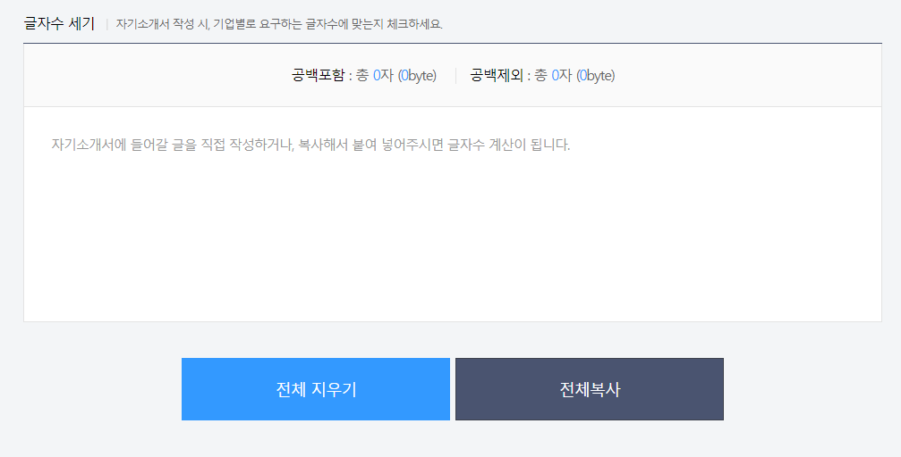

# 래퍼런스

### 잡코리아
[글자수 세기 | 잡코리아](https://www.jobkorea.co.kr/service/user/tool/textcount)

전체 지우기와 전체 복사 버튼, 복사보다 지우기 강조

공백 포함, 공백 제외

글자수만 강조하기 위해 색상 변경

### 사람인

[글자수 세기 | 사람인](https://www.saramin.co.kr/zf_user/tools/character-counter)

지우기보다 복사에 색상 강조. 지우기 = 초기화

주황색으로 글자수 색상 강조

### kidols
[글자수 세기로 자소서나 이력서을 작성](http://www.kidols.net/)

